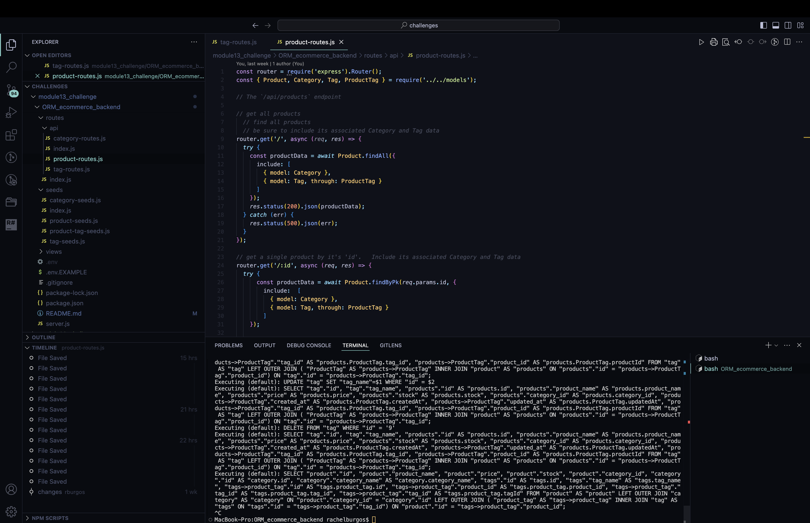
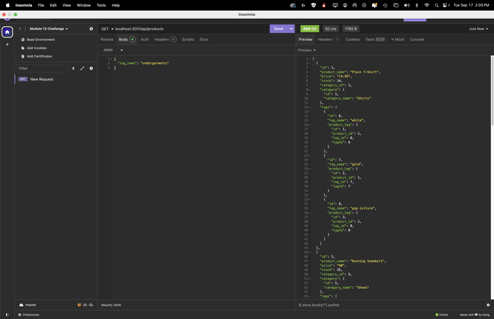
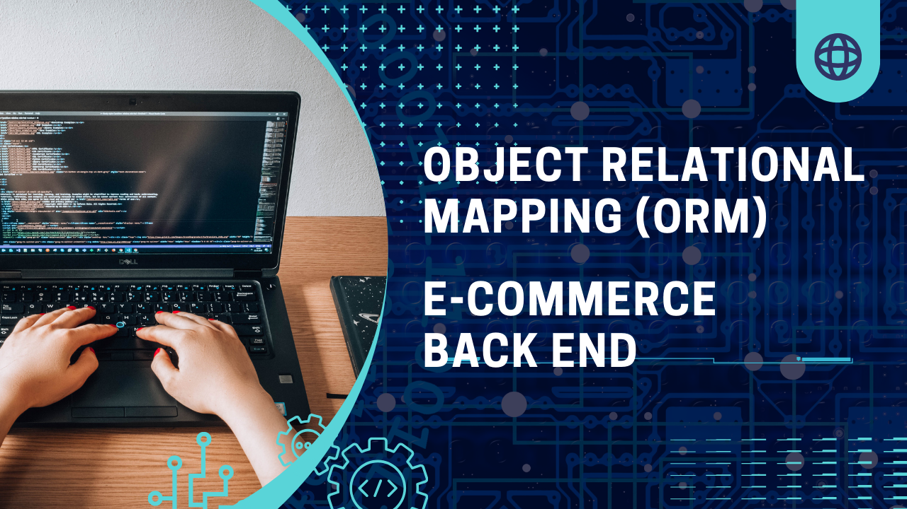

# Object-Relational Mapping (ORM) Challenge: E-commerce Back End

## Description

- This Challenge is to build the back end for an e-commerce site. You’ll take a working Express.js API and configure it to use Sequelize to interact with a PostgreSQL database.

## Tasks Completed

- Added credentials, my database name, PostgreSQL username, and PostgreSQL password to .env file-- Created schema, models and seed commands

- Developed and tested API GET routes in Insomnia Core for categories, products, or tags

- Developed and tested API POST, PUT and DELETE routes and tested in Insomnia Core to ensure user is able to successfully create, update, and delete data in my database

## Installation

- clone the repo

- install npm using `npm i` in terminal

- seed the database with `npm run` seed in terminal

- run application using `npm start`

- open Insomnia Core and test routes

## Usage

## Credits

\*\* This project was accomplished with the help provided by the instructors and TAs of the Rice University Coding Bootcamp, including Instructor Darian Mendez, Mateo Wallace, Mark Alfano, Gerard Mennella

Starter code was used to begin this project, which can be found at:

-- E-commerce Back End Starter Code
<https://github.com/coding-boot-camp/bookish-sniffle>

## License

- License Distributed under the MIT License. See LICENSE.txt for more information.
